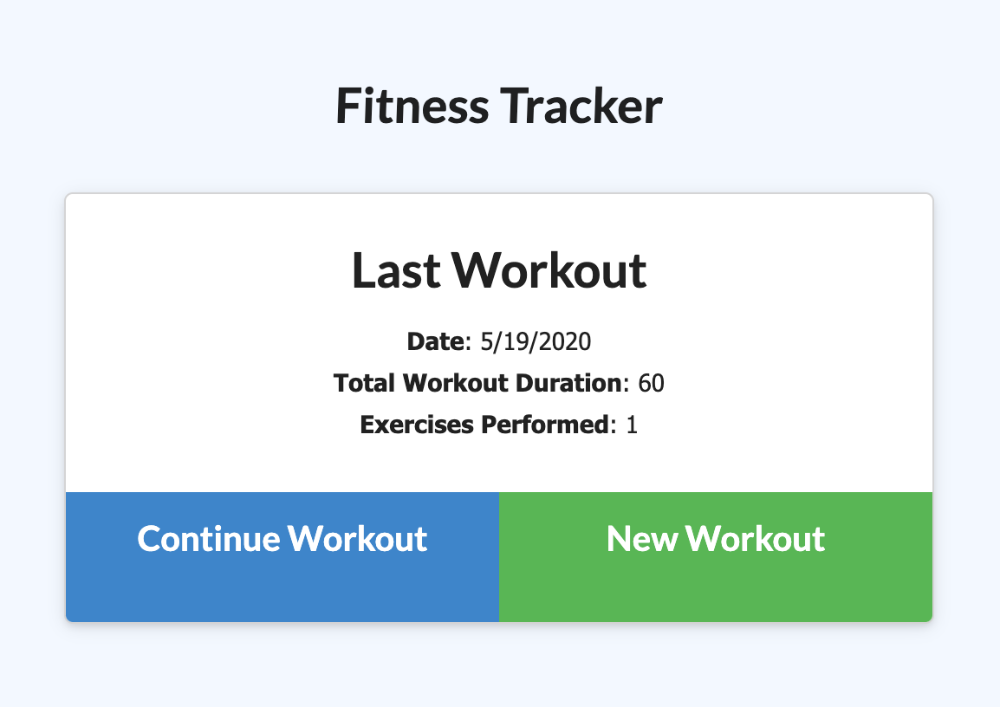

## github.com/dylanhulbert/homework-13
I created the contents of this repo as homework for my Bootcamp at UofO

## Homework 13: Fitness Tracker
The objective of this homework was to use the supplied front end, create routing using express, and the MongoDB schema in Mongoose.  The application uses automatic deployments on commit via [Heroku](https://www.heroku.com/) and a sandbox MongoDB db resource on [mLab](https://www.mlab.com/).

11/28/20 - Updated MongoDB location, from mLab to [Atlas](https://www.mongodb.com/cloud/atlas).

## Technologies
* [Node.js](https://nodejs.org/en/)
* [Express](https://expressjs.com/)
* [Mongoose](https://mongoosejs.com/)
* [MongoDB](https://www.mongodb.com/)

## Application
You can view the functioning application [running on Heroku](https://hulbert-homework-13.herokuapp.com/).

